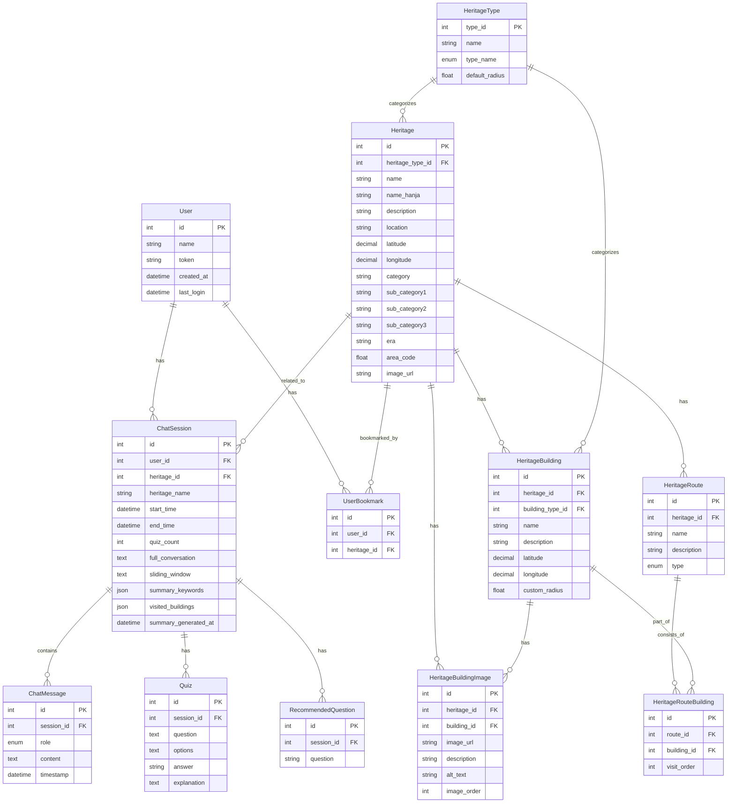

<div align="center" >

# Neonadeuli (너나들이)

<b>Mobile AI National Heritage Interpretation Service</b>


[](https://hits.seeyoufarm.com)

</div>

## ✨ Project Introduction

### 너나들이를 사용하여 대화형 AI 챗봇과 다양한 콘텐츠를 통해 한국의 국가 유산과 역사를 재미있게 탐구해보세요.

- GPS 기반 실시간 국가유산 탐방 및 코스 추천이 가능합니다.
- AI 기반 음성 해설 서비스를 제공합니다. 
- 국가유산에 특화된 AI 챗봇과 실시간 질의 응답이 가능합니다.

## ⚒️ Feature Introduction

### 🤖 국가유산 별 커스텀 AI 챗봇
- 챗봇 기능이 활성화 되면 해당 국가 유산의 전문 지식을 가진 AI 챗봇과 대화합니다.
- 각 국가 유산마다 챗봇 세션은 하나씩만 생성되고, 세션이 종료될 때까지 해당 세션은 유지됩니다.
- AI 챗봇에게 방문한 국가 유산의 문화재 정보를 요구하면 해당 문화재 관련 정보를 제공합니다. 
- AI 챗봇에게 방문한 국가 유산의 문화재 퀴즈를 요구하면 해당 문화재 관련 퀴즈를 제공합니다.
- 텍스트-음성 변환 서비스를 통해 AI 기반 음성 해설 서비스를 제공합니다.

### 🗺️ GPS 기반 실시간 국가유산 탐방
- GPS 기반 실시간 국가유산 탐방 서비스를 제공합니다.
- 방문한 문화재 위치에 맞춰 실시간 정보 제공과 함께 챗봇 인터랙션이 일어납니다.
- 현재 위치를 기반으로 원하는 거리에 따른 필터링 된 국가유산 데이터를 제공합니다.

<!-- ## 🎯 Technical Challenge

### 다음과 같은 과제에 도전했습니다.

<b> 1. 국가유산에 특화된 AI 챗봇을 구현할 수 있다. </b> -->

## 🛢️ ERD



<!-- ## ⛓️ Architecture -->

<!-- ## 🪜 Sequence Diagram -->

## 📖 Project Environment

### 🐍 Main Language
- Python v3.12.4

### 👾 Framework
- FastAPI v0.0.4

### 📒 Main Library
- sqlalchemy v1.4.39
- uvicorn v0.30.1
- aiomysql v0.2.0
- pydantic v2.7.3
- alembic v1.13.1


## 📢 Service Deployment

### 🖇️ Deployment URL
* https://www.neonadeuli.life/

### 🪵 Deployment Log

* https://github.com/neonadeuli-project/Neonadeuli-Backend/releases

    #### ⚭ v0.1.0

    * 새로운 기능
        * 로그인에 토큰 값 response 될 수 있음
        * 토큰 검사 API 추가 (Authorization 헤더에 ”Bearer ${토큰값}”으로 들어감)
        * 로그아웃 API 추가 (Authorization 헤더에 ”Bearer ${토큰값}”으로 들어감)
            * 채팅 세션 생성 API Response 값 변경 (Notion 참고)
            * session_id 추가
    
       → 경복궁 경로 리스트 추가 (이 부분 경복궁 코스로 광화문->흥례문->근정문->경희루 임시 더미데이터 넣어둠)

    #### ⚭ v0.2.0

    -  Database MySQL -> Docker로 변경
    - 채팅 세션 생성, 채팅 요약 중복 방지 로직 추가
    - 채팅 세션 생성 응답 값 업데이트 (세션ID, 위치 좌표 값 추가, 코스 순 오름차순 정렬)
    - 챗봇 정보 제공 API 구현 (추후 파라미터 쿼리 방식 리팩토링 예정)
    - 챗봇 퀴즈 제공 API 구현 및 응답 값 처리 로직 업데이트, 응답 값에 퀴즈 카운트 추가
    - 채팅 세션 종료 API 구현
    - 채팅 요약 API 구현 및 비동기 처리 (세션 종료 API 호출 시 자동 호출)
    - 채팅 시간 값 DB 기준으로 수정
    - 퀴즈 테이블 구현 -> 퀴즈 API 호출 시 해당 데이터 별도 저장
    - 퀴즈 재시도 횟수 메서드 추가 (최대 3번 챗봇 호출 -> 응답 값 파싱 문제로 인한 재호출 로직 구성)
    - sliding window 컬럼 중복 저장 문제 해결

    #### ⚭ v0.3.0

    - 추천 질문 API 2가지 방식으로 구현 완료
 
    1. 건축물 기반 추천 질문 생성 : `POST` [https://neonadeuli.life/api/v1/chat/{session_id}/building/recommend-questions](https://neonadeuli.life/api/v1/chat/%7Bsession_id%7D/building/recommend-questions)

        &rarr; 사용자가 내부 건축물을 이동 시 새로운 건축물의 building_id를 받아 해당 건축물 관련 추천 질문 3가지를 제공

        ```json
        {
            "building_id": 2
        } 
        ```
        ```json
        {
            "building_id": 2,
            "questions": [
                "흥례문에 있는 오얏꽃 문양은 어떤 의미를 가지고 있을까요?",
                "흥례문이 경복궁의 중심인 근정전과 광화문 사이에 위치한 이유는 무엇일까요?",
                "흥례문 복원 공사에 사용된 금강송은 어떤 특징을 가지고 있을까요?"
            ]
        }
        ```
        <br>

    2. 메시지 기반 추천 질문 생성 : `GET` [https://neonadeuli.life/api/v1/chat/{session_id}/message/recommend-questions](https://neonadeuli.life/api/v1/chat/%7Bsession_id%7D/message/recommend-questions)

        &rarr; 사용자의 질문에 대한 직전 AI 답변을 분석하여 그 다음 추천 질문 3가지를 제공
        &rarr; 메시지 전송 API에 비동기 처리되어 미리 추천 질문 응답 생성  및 저장 
        ```
        [
            "1. 1674년에 수리된 경복궁 내전인 교태전과 강녕전은 어떤 역사적 의미를 가지고 있나요?",
            "2. 1688년에 왕비에 책봉된 희빈 장씨가 거처한 내전인 취선당은 어떤 건축적 특징을 가지고 있나요?",
            "3. 1711년에 건설된 금천교는 어떤 구조와 형태를 가지고 있으며, 조선시대 다리 건축에 어떤 영향을 미쳤나요?"
        ]
        ```

    * 건축물 이미지 추가 API : `POST` [https://neonadeuli.life/api/v1/image/heritage/{heritage_id}/add-building?building_id=1&description=viaunixue&alt_text=네로](https://neonadeuli.life/api/v1/image/heritage/%7Bheritage_id%7D/add-building?building_id=1&description=viaunixue&alt_text=%EB%84%A4%EB%A1%9C)

    * 건축물 이미지 조회 API : `POST` [https://neonadeuli.life/api/v1/image/heritage/{heritage_id}/find-building](https://neonadeuli.life/api/v1/image/heritage/%7Bheritage_id%7D/find-building)
        ```json
        {
            "images": [
                {
                    "id": 1,
                    "building_id": 1,
                    "image_url": "https://example.com/images/gwanghwamun.jpg",
                    "description": "광화문의 전경",
                    "alt_text": "광화문 정면 사진",
                    "image_order": 1,
                    "created_at": "2024-08-02T05:36:48",
                    "updated_at": null
                }
            ]
        }
        ```

    * 문화재 리스트 조회 API : GET https://neonadeuli.life/api/v1/heritages/lists?user_latitude=37.5665&user_longitude=126.9780&page=2&limit=10
        * 문화재 리스트 조회 테스트를 위해 Heritage 테이블에 더미 데이터 문화재 약 100개 삽입
        * 현재 일단 파라미터에 유저 위도, 유저 경도, Page, limit request 값으로 설정
        * pagination 구조
        ```json
        [
            {
                "id": 11,
                "name": "양동마을",
                "location": "경상북도 경주시 강동면 양동리",
                "heritage_type": "시도유형문화유산",
                "image_url": "https://example.com/yangdong_village.jpg",
                "distance": 266.5
            }, ...
        ```

    * 문화제 상세 조회 API : `GET` [https://neonadeuli.life/api/v1/heritages/{heritage_id}/details](https://neonadeuli.life/api/v1/heritages/%7Bheritage_id%7D/details)
        ```json
        {
            "id": 15,
            "image_url": "https://example.com/sungnyemun_registered.jpg",
            "name": "서울 숭례문",
            "name_hanja": "서울 崇禮門",
            "description": "한양도성의 남대문",
            "heritage_type": "시도등록유산",
            "category": "건조물",
            "sub_category1": "성문",
            "sub_category2": null,
            "era": "조선시대",
            "location": "서울특별시 중구 세종대로 40"
        }
        ```

    #### ⚭ v0.3.1

    * 현재 DB에 총 15439개 문화재 데이터 INSERT 완료했습니다. 이제 해당 데이터로 문화재 조회가 가능합니다.
    * 문화재 리스트 조회에 총 3가지 필터링 기능과 2가지 정렬 옵션을 추가했습니다.
        * 필터링 기능
            * area_code - 지역 코드를 기반으로 위치 필터링이 가능합니다. 구체적인 필터 코드는 다음과 같습니다.
                * 11 : 서울  21 : 부산  22 : 대구  23 : 인천  24 : 광주  25 : 대전  26 : 울산  45 : 세종  31 : 경기  32 : 강원  33 : 충북  34 : 충남  35 : 전북  36 : 전남  37 : 경북  38 : 경남  50 : 제주
            * heritage_type  - 문화재 유형 코드를 기반으로 유형 필터링이 가능합니다. 구체적인 필터 코드는 다음과 같습니다. 
            (heritage_type은 중복으로 추가 가능)
                * 11 : 국보  12 : 보물   13 : 사적  14 : 사적및명승   15 : 명승  16 : 천연기념물   17 : 국가무형유산  18 : 국가민속문화유산
    21 : 시도유형문화유산  22 : 시도무형유산   23 : 시도기념물  24 : 시도민속문화유산   25 : 시도등록유산  31 : 문화유산자료
    79 : 국가등록유산  80 : 이북5도 무형유산
            * distance_range  - 사용자 GPS값 기반으로 거리 필터링이 가능합니다. 구체적인 필터 코드는 다음과 같습니다. (단위는 km 입니다.)
                * 0-0.5 , 0.5-1 , 1-10, 10-100, 100-1000 
        * 정렬 기능
            * sort_by - 문화재 ID 또는 문화재와 사용자 사이 거리  기준으로 정렬이 가능합니다. 
            구체적인 필터 코드는 다음과 같습니다.
                * id, distance
            * sort_order - 오름차순 또는 내림차순으로 필터코드는 한글 그대로 설정해두었습니다. 
            따라서 필터코드는 오름차순 과 내림차순  입니다.

    * 예제 URL :
    [https://neonadeuli.life/api/v1/heritages/lists?user_latitude=37.5665&user_longitude=126.9780&page=2&limit=10&area_code=11&distance_range=1-10&heritage_type=11&heritage_type=13&sort_by=id&sort_order=오름차순](https://neonadeuli.life/api/v1/heritages/lists?user_latitude=37.5665&user_longitude=126.9780&page=2&limit=10&area_code=11&distance_range=1-10&heritage_type=11&heritage_type=13&sort_by=id&sort_order=%EC%98%A4%EB%A6%84%EC%B0%A8%EC%88%9C)

    * 문화재 이름에 따른 동적 프롬프트 구현을 완료했습니다. 
    이제 사용자가 방문하는 문화재에 대한 챗봇이 시작되면 해당 문화재에 맞는 전용 AI챗봇이 대답해줍니다.

    * 이미지 링크 접근 권한 이슈를 해결했습니다. DB에 이미지 추가 후 해당 링크로 이미지 확인이 가능합니다.

    #### ⚭ v0.3.2

    - 채팅 메시지에서 발생하던 딜레이 관련 쿼리문 개선이 완료되었습니다.

    - 문화재 리스트 조회에 총 2가지 필터링 기능 기능을 추가했습니다

        - name - 문화재 이름을 기반으로 이름 필터링이 가능합니다.
        - era_category - 시대명을 기반으로 시대 필터링이 가능합니다. 구체적인 필터 코드는 다음과 같습니다.
            - 전체, 선사시대, 석기시대, 청동기시대, 철기시대, 삼한시대, 삼국시대, 삼국:고구려, 삼국:백제, 삼국:신라, 발해, 통일신라, 고려시대, 조선시대, 대한제국시대, 일제강점기

    #### ⚭ v0.3.3

    네이버 Clova Voice 기능이 추가되었습니다.

    텍스트를 음성으로 변환하여 mp3 파일로 제공됩니다.
    채팅 메시지 API 응답 값에 추가되어 해당 AI 챗봇의 대답을 음성으로 제공해줍니다.
    
    수정된 채팅 메시지 API 응답 값 예시

    ```json
    {
        "id": 68,
        "session_id": 12,
        "role": "assistant",
        "content": "경복궁에서 날씨가 좋으면 경치가 좋은 곳은 경회루이오. 경회루는 경복궁 근정전 서북쪽 연못 안에 세운 건물로, 나라에 경사가 있거나 사신이 왔을 때 연회를 베풀던 곳이오.\n\n경회루의 연못에서는 아름다운 연꽃이 피고, 주변의 버드나무와 어우러져 멋진 풍경을 자랑하오. 특히, 봄과 가을에는 꽃과 단풍이 어우러져 더욱 아름다운 모습을 볼 수 있소.\n\n경회루는 국보 제224호로 지정되어 있으며, 조선 시대 건축 기술의 정수를 보여주는 건축물이오. 날씨가 좋은 날에는 경회루에 올라 아름다운 경치를 감상해 보는 것을 추천하오.",
        "timestamp": "2024-08-08T01:25:56",
        "audio_url": "https://zyyosrdkcdcm25870576.cdn.ntruss.com/audio/f1723080-c7ce-4dfa-a054-e320b9ee396f.mp3"
    }
    ```

    * 퀴즈 및 요약 프롬프트 값 조정

    * 챗봇 파라미터 수정

    * 문화재 리스트 조회 API에 기능이 추가되었습니다.

        * 필터링 이후 문화재 전체 개수가 제공됩니다.
        * 해당 데이터 제공을 위해 이전의 응답 값에서 일부 형태가 수정되었습니다.

    * 수정된 문화재 리스트 조회 API 응답 값 예시
    ```json
    {
        "items": [
            {
                "id": 16525,
                "name": "고흥도천리지석묘군",
                "location": "전남 고흥군 과역면 도천리 산21번지 외",
                "heritage_type": "문화유산자료",
                "image_url": "http://www.cha.go.kr/unisearch/images/cultural_material/1662222.jpg",
                "distance": 321.6
            }, ...
        ],
        "total_count": 41,
        "page": 5,
        "limit": 10
    }
    ```

    * 문화재 상세 조회 응답 오류 해결

        * heritage_type 엔티티와 join 처리 완료
        * 반환 값 location 파싱 처리 완료
    
    * 프롬프트 수정 후 퀴즈 파싱 이슈 해결

        * 정답과 설명 파싱 정규화 수정 및 추가 완료


## 🛎️ API Specification

* https://neonadeuli.life/docs

### users

|URL|페이지 설명|GET|POST|PUT|DELETE|로그인 권한| 작성자 권한|
|------|---|:---:|:---:|:---:|:---:|:---:|:---:|
|/api/v1/users/login|임시 로그인| |✅| | | | |
|/api/v1/users/validate_token|유저 토큰 검사|✅| | | | | |
|/api/v1/users/logout|로그아웃| |✅| | | | |

### chat

|URL|페이지 설명|GET|POST|PUT|DELETE|로그인 권한| 작성자 권한|
|------|---|:---:|:---:|:---:|:---:|:---:|:---:|
|/api/v1/chat/sessions|채팅 세션 생성| |✅| | | |
|/api/v1/chat/sessions/{session_id}/message|채팅 메시지 전송| |✅| | | | |
|/api/v1/chat/{session_id}/heritage/buildings/info|건축물 정보 제공| |✅| | | | |
|/api/v1/chat/{session_id}/heritage/buildings/quiz|건축물 퀴즈 제공| |✅| | | | |
|/api/v1/chat/{session_id}/heritage/building/recommend-questions|건축물 기반 추천 질문| |✅| | | | |
|/api/v1/chat/{session_id}/heritage/message/recommend-questions|메시지 기반 추천 질문|✅| | | | | |
|/api/v1/chat/{session_id}/summary|채팅 요약|✅| | | | | |
|/api/v1/chat/{session_id}/end|채팅 종료| |✅| | | | |
|/api/v1/chat/{session_id}/status|채팅 세션 상태 확인|✅| | | | | |

### heritages

|URL|페이지 설명|GET|POST|PUT|DELETE|로그인 권한| 작성자 권한|
|------|---|:---:|:---:|:---:|:---:|:---:|:---:|
|/api/v1/heritages/lists|국가유산 조회|✅| | | | |
|/api/v1/heritages/{heritage_id}/details|국가유산 상세 조회|✅| | | | |

### image

|URL|페이지 설명|GET|POST|PUT|DELETE|로그인 권한| 작성자 권한|
|------|---|:---:|:---:|:---:|:---:|:---:|:---:|
|/api/v1/image/update-heritage|국가유산 이미지 수정| |✅| | | |
|/api/v1/image/heritage/{heritage_id}/add-building|내부 건축물 이미지 추가| |✅| | | |
|/api/v1/image/heritage/{heritage_id}/find-building|내부 건축물 이미지 조회| |✅| | | |
|/api/v1/image/delete-building|내부 건축물 이미지 삭제| |✅| | | |

## ⛩️ File Tree

```
📦app
 ┣ 📂audio
 ┣ 📂core
 ┃ ┣ 📜config.py
 ┃ ┣ 📜database.py
 ┃ ┣ 📜deps.py
 ┃ ┗ 📜security.py
 ┣ 📂error
 ┃ ┣ 📜auth_exception.py
 ┃ ┣ 📜chat_exception.py
 ┃ ┣ 📜heritage_exceptions.py
 ┃ ┗ 📜image_exception.py
 ┣ 📂models
 ┃ ┣ 📂chat
 ┃ ┃ ┣ 📜chat_message.py
 ┃ ┃ ┗ 📜chat_session.py
 ┃ ┣ 📂heritage
 ┃ ┃ ┣ 📜heritage.py
 ┃ ┃ ┣ 📜heritage_building.py
 ┃ ┃ ┣ 📜heritage_building_image.py
 ┃ ┃ ┣ 📜heritage_route.py
 ┃ ┃ ┣ 📜heritage_route_building.py
 ┃ ┃ ┗ 📜heritage_type.py
 ┃ ┣ 📜enums.py
 ┃ ┣ 📜init.py
 ┃ ┣ 📜question.py
 ┃ ┣ 📜quiz.py
 ┃ ┣ 📜user.py
 ┃ ┗ 📜user_bookmark.py
 ┣ 📂repository
 ┃ ┣ 📜chat_repository.py
 ┃ ┣ 📜heritage_repository.py
 ┃ ┣ 📜image_repository.py
 ┃ ┗ 📜user_repository.py
 ┣ 📂router
 ┃ ┣ 📂v1
 ┃ ┃ ┣ 📂__pycache__
 ┃ ┃ ┃ ┣ 📜chat.cpython-311.pyc
 ┃ ┃ ┃ ┣ 📜heritage.cpython-311.pyc
 ┃ ┃ ┃ ┣ 📜image.cpython-311.pyc
 ┃ ┃ ┃ ┗ 📜user.cpython-311.pyc
 ┃ ┃ ┣ 📜chat.py
 ┃ ┃ ┣ 📜heritage.py
 ┃ ┃ ┣ 📜image.py
 ┃ ┃ ┗ 📜user.py
 ┃ ┗ 📜api.py
 ┣ 📂schemas
 ┃ ┣ 📜chat.py
 ┃ ┣ 📜heritage.py
 ┃ ┣ 📜image.py
 ┃ ┗ 📜user.py
 ┣ 📂service
 ┃ ┣ 📜chat_service.py
 ┃ ┣ 📜clova_service.py
 ┃ ┣ 📜heritage_service.py
 ┃ ┣ 📜image_service.py
 ┃ ┣ 📜s3_service.py
 ┃ ┣ 📜user_service.py
 ┃ ┗ 📜validation_service.py
 ┗ 📂utils
 ┃ ┣ 📜common.py
 ┃ ┗ 📜prompts.py
```

## 👨‍👩‍👧‍👦 Backend Team Member

|[viaunixue](https://github.com/viaunixue) | [swwho96](https://github.com/swwho96) |
|:--------:|:---------:|
|  |  |